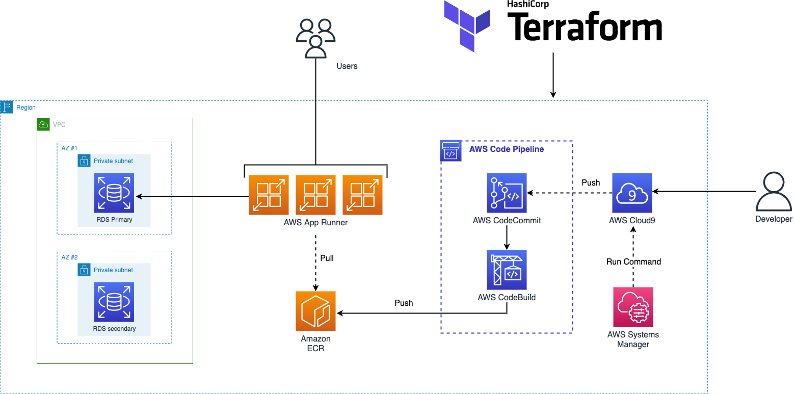

# Build and Deploy Spring Petclinic Application to AWS App Runner using AWS CodePipeline, Amazon RDS and Terraform 

## Introduction

This workshop is designed to enable engineers to get some hands-on experience using AWS CI/CD tools to build pipelines for Serverless Container workloads. The workshop consists of a number of lab modules, each designed to demonstrate a CI/CD pattern. You will be using AWS services like AWS App Runner, Amazon RDS, AWS CodePipeline, AWS CodeCommit and AWS CodeBuild. 

[AWS App Runner](https://aws.amazon.com/apprunner/) leverages AWS best practices and technologies for deploying and running containerized web applications at scale. This leads to a drastic reduction in your time to market for new applications and features. App Runner runs on top of AWS ECS and Fargate. App Runner is a lot easier to get into, cost estimation for App Runner is far simpler — AWS charges a fixed CPU and Memory fee per second.

## Background

The Spring PetClinic sample application is designed to show how the Spring application framework can be used to build simple, but powerful database-oriented applications. It uses AWS RDS (MySQL) at the backend and it will demonstrate the use of Spring's core functionality. The Spring Framework is a collection of small, well-focused, loosely coupled Java frameworks that can be used independently or collectively to build industrial strength applications of many different types. 

## Architecture

## Prerequisites

Before you build the whole infrastructure, including your CI/CD pipeline, you will need to meet the following pre-requisites. 

If you are running this workshop as part of an AWS event please follow the instructions [here](docs/AWS_Event.md), otherwise if you're using your own AWS account to run this workshop on your own please follow instructions [here](docs/Your_Own_Account.md).

